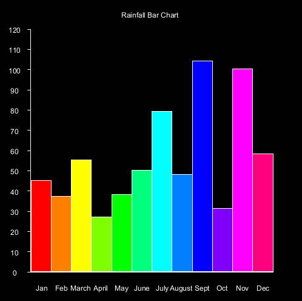
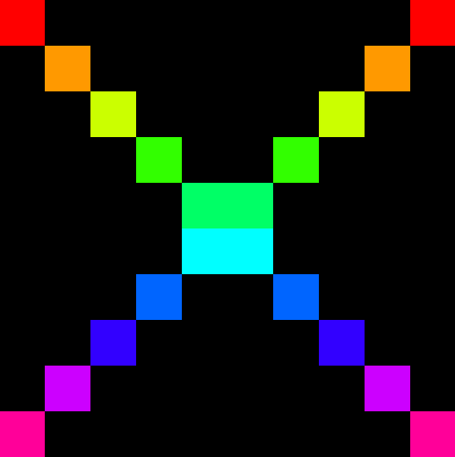
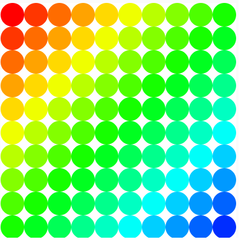
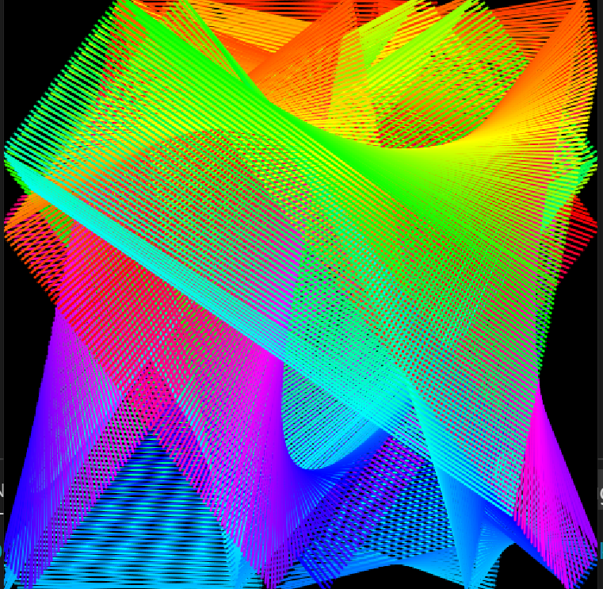

# DT228/DT282 Object Oriented Programming 2020-2021

# Teams Links for online classes:

- [Monday Class](https://teams.microsoft.com/l/meetup-join/19%3ameeting_YjUzNjZlMDMtOTNhZi00MDYyLThkODgtNzQxYjBjZDY3YTg0%40thread.v2/0?context=%7b%22Tid%22%3a%22766317cb-e948-4e5f-8cec-dabc8e2fd5da%22%2c%22Oid%22%3a%2261aab78b-a857-4647-9668-83d4cca5de03%22%7d)
- [Wednesday Labs](https://teams.microsoft.com/l/meetup-join/19%3ameeting_OWVjNDM4NTAtOGJhOC00MjEyLTkzMTMtNzA3OTgwOGNhZTYw%40thread.v2/0?context=%7b%22Tid%22%3a%22766317cb-e948-4e5f-8cec-dabc8e2fd5da%22%2c%22Oid%22%3a%2261aab78b-a857-4647-9668-83d4cca5de03%22%7d)
- [Thursday Tutorial](https://teams.microsoft.com/l/meetup-join/19%3ameeting_MGU3Mzg3N2YtMzkxZC00OThjLWFmNjItYzVlNDZhNWY5OWY2%40thread.v2/0?context=%7b%22Tid%22%3a%22766317cb-e948-4e5f-8cec-dabc8e2fd5da%22%2c%22Oid%22%3a%2261aab78b-a857-4647-9668-83d4cca5de03%22%7d)
- [Sign in Sheet for labs](https://docs.google.com/spreadsheets/d/1dpzq-iS3DPHBin2oT_txSlmsIEVo_zs524FemMm-2vI/edit?usp=sharing)

Resources
---------
- [Install the software you will need for this module](install.md)
* [The Java Tutorial from Oracle](http://docs.oracle.com/javase/tutorial/)
* [Games Fleadh](http://www.gamesfleadh.ie/)
* [The Nature of Code](http://natureofcode.com/)
* [The git manual - read the first three chapters](http://git-scm.com/documentation)
* [A video tutorial all about git/github](https://www.youtube.com/watch?v=p_PGUltnB6w)
* [The Processing language reference](http://processing.org/reference/)

## Contact the lecturer
* Email: bryan.duggan@dit.ie
* Twitter: [@skooter500](http://twitter.com/skooter500)

# Assessments

- [Assignments](assignments.md)

- Week 11 Lab Test 20% 
- Week 12 Assignment Submission - 30%
- End of Year exam - 50%

# Previous Years Lab Tests

- https://github.com/skooter500/OOP-LabTest-2020-Starter
- https://github.com/skooter500/OOP-LabTest-2020/
- https://github.com/skooter500/OOP-Test-2019-Starter
- https://github.com/skooter500/OOP-Test-2019-Solution
- https://github.com/skooter500/OOP-2018-Lab-Test-2
- https://github.com/skooter500/OOP_Labtest1_2017_Starter
- https://github.com/skooter500/OOP-LabTest1-2016

# Week 7 - Audio
- [Minim library reference](http://code.compartmental.net/minim/)

Some audio responsive stuff I have been working on recently:

[](https://www.youtube.com/watch?v=4Fc_OW4M5AU)

[](https://www.youtube.com/watch?v=xF7VrXZqLko)

[](https://www.youtube.com/watch?v=KNymjRyr27A)

# Week 6 - Star Map ArrayList, classes, CSV files

##  Lab
### Learning Outcomes
- Make a class
- Make constructors & accessor methods
- Use an ArrayList
- Develop problem solving & algorithm design skills

Try this [lab test from last year](https://github.com/skooter500/OOP-LabTest-2020-Starter). You can use the StarMap example we made in the class on Monday for help.

## Tutorial
- [Video of the tutorial (Solution to the lab)](https://web.microsoftstream.com/video/d11928a7-1195-4116-9fa0-1f59a7ef9c4e?list=studio)

## Lecture
- [Video of the class](https://web.microsoftstream.com/video/2c196702-f54f-47ad-abf0-be8455d20d02)

# Week 5 - Conway's Game of Life

## Tutorial
- [Video of the tutorial](https://web.microsoftstream.com/video/7dbf1ef3-3857-4952-b840-f27b3a3187a4)
- [Life with no colors](java/src/ie/tudublin/Life.java)
- [The colorful Game of Life we made in the tutorial](java/src/ie/tudublin/ColorfulLife.java)

## Lab

- [Video of the lab](https://web.microsoftstream.com/video/decb45c9-a4a6-45a9-bb25-0b299c1a3c29)

### Learning Outcomes
- Learn how to iterate over a 2D array
- Explore the magic of cellular automata
- Learn how to use map

Update your fork of the repo from the master branch to get the bug fixed code from Monday's class and create a branch for your work today. I discovered another bug in the code we wrote on Monday. In countNeighbours, the line:

```Java
if (r != row && c != col)                
```

Should have been:

```Java
if (! (r == row && c == col))                
```

In Life.java:

Write the method ```updateBoard```. This method should iterate over the board cell by cell using a nested for loop and apply the Game of Life rules:

1. If the cell is alive (true) then if the cell has exactly 2 or 3 neighbours it survives (gets set to true), otherwise it dies (gets set to false)
2. If the cell is dead (false) then it comes to life if it has exactly 3 neighbours, otherwise it stays dead in the next generation.

This is important so please read carefully!!

You have to read values from *board*, but you set values in *next*, which is a 2D array the same size as board. At the end of the method you *swap* board and next. I have left the swapping code in the method, so you don't have to write it. This is so that when you for example, kill a cell or bring a cell to life, you don't screw up the count for other cells in that generation.

Again - in ```updateBoard```

1. Write a nested for loop that gets the row and col for every cell
2. Count the neighbours (use the method we wrote on Monday for this) 
2. Check if the cell is alive, apply the rules for alive cells to next
2. If the cell is dead, apply the rules for dead cells to next
2. Swap board and next

Your game of life should look like this if you implement the rules correctly (click the image for a video):

[](https://www.youtube.com/watch?v=SmH2r_ChmFY)

Some extra things you can implement you can see in the video:

- Increase size and change the size of the screen and see what effect this has on the simulation 
- Press space to pause and resume the simulation
- Press 1 to randomise the board again
- Press 2 to clear the board
- Press 3 to draw a cross shape and see how it evolves
- Drag the mouse across the window to set cells at the mouse position to be alive.

Some extra things you can implement that are not in the video

- Draw a glider at the mouse position. This is starting pattern that will evolve a pattern that walks across the screen
- Draw a Gosper Gun at the mouse position. This is a starting pattern that will spawn creatures indefinitely

You can read more about these starting patterns and others in [this wikipedia article](https://en.wikipedia.org/wiki/Conway%27s_Game_of_Life) and see examples in this video:

[](https://www.youtube.com/watch?v=HMYh4jKdtNU)

If you want to learn more about cellular automata check out: 

- [The Nature of Code](https://natureofcode.com/)
- [A New Kind of Science](https://writings.stephenwolfram.com/2017/05/a-new-kind-of-science-a-15-year-view/)

## Lecture
- [Epic Conways Game of Life](https://www.youtube.com/watch?v=C2vgICfQawE)
- [3D Game of Life](https://www.youtube.com/watch?v=dQJ5aEsP6Fs)
- [John Conway talks about the game of life](https://www.youtube.com/watch?v=FdMzngWchDk)
- [Video of the class](https://web.microsoftstream.com/video/d621064f-86c0-4f76-8a12-b5b9ab4cfa18)
- [The Dream of Life](https://www.youtube.com/watch?v=wU0PYcCsL6o)

There is a bug in the code we wrote in the class:

The bounds checking on the arrays we wrote in the class is:

```
if (row > 0 && row < size -1 && col > 0 && col < size -1)
```

And it should be

```
if (row >= 0 && row < size -1 && col >= 0 && col < size -1)
        
```

Thanks to Luke O Shea Scanlan for pointing this out!

I pushed the corrected code to the repository

# Week 4 - Arrays

- [Tutorial Video 1](https://web.microsoftstream.com/video/0733d852-294b-4e45-b6e8-253ffba434d1?list=studio)
- [Tutorial Video 2](https://web.microsoftstream.com/video/7991059b-bc69-4f04-9521-bc4832eb3432?list=studio)

## Lab 
### Learning Outcomes
- Practice iterating over arrays
- Practice computational thinking

Check out this video of the assignment I wrote in GWBasic for the statistics module in first year WMT in Kevin St in 1990 (click the image for video):

[](https://www.youtube.com/watch?v=p3Vui6q_wPw)

And here is the [source code](https://github.com/skooter500/StatsAssignment) in case you are interested!

Inspired by the video, see if you can write code to generate the following graphs of the rainfall data. Start with the file Arrays.java. You will find these *much easier* if you use the [map function](https://processing.org/reference/map_.html) we learned in Monday's class. 

When you are doing these, make sure your code works even if you change the size of the drawing window or change the values in the array.

- A bar chart:

  

  Start by drawing the axis, then draw the ticks and print the text, then draw the bars. You can use ```textAlign(CENTER, CENTER)``` to align the text
  Use the HSB color space to assign different colors to each bar

- A trend line:

	

  This one is a bit trickier because you have to calculate the start xy and end xy for each line. Your for loop for drawing the trend lines can start at 1 instead of 0 and then you can get the previous value for the start of each line by taking rainfall[i - 1].

- A pie chart 

	

	You can use the the [arc function](https://processing.org/reference/arc_.html) to draw arcs and sin & cos to calculate the x and y coordinates to print the text. This one is the most challenging. Remember that a pie chart shows the proportion of each data point in the sum of all the data, so you will have to calculate the sum of all the rain fall and figure out how much each month is relative to the sum. It's best to draw the segments first and then draw the labels. Your map function might look something like this:

	```Java
	float angle = map(rainfall[i], 0, sum, 0, TWO_PI);
	```

Don't forget to update your forks of the repository from my master branch and create a new branch for your work today!!

## Lecture
- [Video of the class](https://web.microsoftstream.com/video/7617735a-c42f-49c3-942f-a85b106b78d1)
- [map](https://processing.org/reference/map_.html)
- Check out Arrays.java
- [Arrays in Java reference](https://docs.oracle.com/javase/tutorial/java/nutsandbolts/arrays.html)

# Week 3 - Git, the if statement and loops in Java

## Tutorial 
- [Video of the tutorial going through the lab solution](https://web.microsoftstream.com/video/3dd5eda0-e34a-4e05-b442-990a0327cc45)

## Lecture 
- [Read the git manual](https://git-scm.com/docs/user-manual.html)
- The if statement
- While loops
- For loops
- [Video of the class](https://web.microsoftstream.com/video/11af5059-42a8-4321-99f1-ac2d8f4d78e2)
- [Markdown tutorial](https://github.com/skooter500/MusicVisuals)

## Lab
### Learning outcomes
- Practice procedural drawing with loops
- Develop computational thinking skills, by making variables and constructing algorithms

Update your forks of the repo to get the code we wrote on Monday and create a branch for your work today. Don't commit onto the master branch!

Complete the procedural drawing exercises below by editing the file Loops.java. You can check the value of the "which" variable which will be in the range 0-9 and use this to determine which exercise gets drawn. There are > 12 exercises so some of the numbers will have to draw more than one exercise. 

## Procedural drawing exercises:

### if statement 

- 3 exercises. Click the image for video:

[](https://www.youtube.com/watch?v=18kMOeygmHA)

### for loops:

Use a loop, rect and the HSB colour space:


Use a loop, rect and the HSB colour space:


Use a loop, rect and the HSB colour space:



Use a loop, ellipse, and the HSB colour space:


Use a loop, ellipse and the HSB color space to draw this:


Use a nested loop to draw this:



Try and draw this using ONE for loop. You will need the [text](https://processing.org/reference/text_.html) and [textAlign](https://processing.org/reference/textAlign_.html) functions:


Use a nested loop to draw this:


Use sin and cos to draw this:


Use line, sin and cos to draw regular polygons like squares, pentagons, octogons etc:


Draw a procedural star like these:


# Week 2 - Hello Processing

## Tutorial
- [Solution to the lab video](https://web.microsoftstream.com/video/4129e73d-ed22-498b-afcc-0d1e3c3178fb)

## Lab

## Learning Outcomes
- Practice drawing stuff and working out co-ordinates
- Practice using variables and if statements in Java

This is a video of a silly game called Bugzap made in Java using the Processing libraries. Today we can make a part of this game in order to get some practice using variables in Java. 

[](https://www.youtube.com/watch?v=s6PA8jtWneQ)

How you should do it:

Ok let's get the main game working first and not worry about the splash screen and the game over screen

- Update your fork of the repository from the master branch. To do this, cd to the folder where you have cloned *your* repository, (or clone it somewhere if you need to) and type:

```bash
git checkout master
git pull upstream master
```

- Create a branch for your work today by typing:

```
git checkout -b lab2
```

- Create a new class called BugZap.java in the ie.tudublin folder. Make it extend ```PApplet``` and add the ```settings```, ```setup``` and ```draw``` methods. Check out HelloProcessing2.java if you need examples for these. This class also has examples of the drawing methods with comments. You can also check out the [Processing reference]() if you are unsure about any of the methods.
- Call ```size``` in ```settings``` to set the size of the drawing window. 
- Edit the file Main.java so that it starts the BugZap class instead of the HelloProcessing2 class. I'll let you figure out how to do this :-)
- Make sure everything works by compiling and running your program before continuing!

Now we can draw the bug.

- Make fields of type ```float``` in the BugZap class for ```playerX```, ```playerY``` and ```playerWidth``` and give these default values. You can decide what these should be. There are built in variables called ```width``` and ```height``` that give the width and height of the drawing window. These only get assigned after size has been called, so if you want to use these to give values to playerX, playerY etc. put the code into the *setup* method. 
- Write a method called void ```void drawPlayer(float x, float y, float w)``` that draws the player character, centered around the parameters x, y. You can use the line method to do this. You can pass variables as parameters to this method and also things like ```x + 20```, ```w * 0.5f``` etc. I made an extra variable in this method called h for the height and set it to be half the w parameter. Don't forget to set the stroke color!
- Call this method from ```draw```, passing in the parameters playerX, playerY and playerWidth.
- Compile and run everything to make sure it's working before continuing.
- If everything is working ok, you should see the bug on the screen

Now lets get the player moving in response to the keys

Add this method to BugZap.java:

```Java
public void keyPressed()
	{
		if (keyCode == LEFT)
		{
			System.out.println("Left arrow pressed");
		}
		if (keyCode == RIGHT)
		{
			System.out.println("Right arrow pressed");
		}
		if (key == ' ')
		{
			System.out.println("SPACE key pressed");
		}
	}	
```

- If you compile and run the program again you will see that some messages get printed out when you press various keys. If you are running in Visual Studio Code, you will see these messages appear in the Debug Console
- Modify this method to increment and decrement the playerX variable instead and you should be able to get the player to move left and right
- You might want to add if statements to this method to stop the player moving off the left and right side of the screens. If statements in Java are almost the same as in C!
- When the player presses SPACE you will want to draw a line for the player's laser.

The Bug

- In a similar way to how you made the player, make the Bug. Make variables and drawBug method. Don't forget to call the method from draw()
- To move the bug you can add a random amount to it's x coordinate on intervals. To generate a random number you can use the [random](https://processing.org/reference/random_.html) function.  
- One way to make stuff happen on an interval rather than every frame is to use the frameCount variable. This variable is a field in PApplet and it gets incremented automatically every time draw is called. Because draw gets called 60 times a second, you can do something every second with this code:

```Java
if ((frameCount % 60) == 0)
{
    // Do something
}
```

- You can print text to the screen using the [text](https://processing.org/reference/text_.html) function.

Ok you should now have the basics working. See if you can figure out how to check to see if the player hits the bug, add scoring, splash screen, game over screen and sound.

## Lecture
- Check out the HelloProcessing2 class in the repo
- We drew the all seeing eye using the Processing drawing methods
- if statement exercises


# Week 1 - Introduction

## Tutorial
- [Coding Bat](https://codingbat.com/)

## Lab
## Learning outcomes
- Set up Java, Visual studio code and the Java Extensions
- Fork the repo, configure the upstream remotes
- Write your first Java code using command line tools
- Test out Visual Studio Code

## Part 1 - Installing Java

Install the software you will need for this module and set up your path to the Java Development Kit. [This document explains how to do it](install.md).

## Part 2 - Forking the repo

Firstly fork *this* repository by clicking the fork button above, so that you get your own copy of the course repo to work on this semester. Now create a new empty folder on your computer somewhere right click on the folder and choose git bash here. Alternatively you can start the bash and cd to the new folder. To clone the repository for your fork:

```bash
git clone https://github.com/YOURGITUSERNAME/OOP-2020-2021
```

Replace YOURGITUSERNAME with your github username. You can also copy the URL to the repo from your browser and paste it into the console. To paste into the bash on Windows is right click. You can use Cmd + C, Cmd + V on the Mac.

Now cd into the repo and check the origin and upstream remotes are set up correctly

```bash
cd OOP-2020-2021
git remote -v
```

You should see something like this:

```bash
origin  https://github.com/YOURGITUSERNAME/OOP-2020-2021 (fetch)
origin  https://github.com/YOURGITUSERNAME/OOP-2020-2021 (push)
upstream  https://github.com/skooter500/OOP-2020-2021 (fetch)
upstream  https://github.com/skooter500/OOP-2020-2021 (push)
```

If you don't see the upstream remote, you can set it up by typing

```bash
git remote add upstream https://github.com/skooter500/OOP-2020-2021
```
You can read more about forking a git repository and setting up the upstream remote in [this article](https://help.github.com/en/github/getting-started-with-github/fork-a-repo)

Once the upstream is setup, you will be able to push code to your own repo and also keep it up to date with the master branch of the changes I make each class.

If you already forked the repo before the lab, you may need to update your master branch from my master branch to get the changes I made:

```bash
git fetch
git checkout master
git pull upstream master
git push
```

## Part 3 - Compiling & running Java

To compile and run the Java code in the src folder, you should type:

```bash
cd java
javac src/ie/tudublin/*.java -d bin
java -cp bin ie.tudublin.Main
```

You should see

```
Hello world
Misty
TopCat
Garfield
Garfield
```

On the terminal. If you do, then congratulations! You have successfully compiled and run your first Java program using the command line tools. Now create a branch to store your changes today. Best not to modify the master branch so you can keep it up to date with my changes:

```bash
git checkout -b lab1
```

Use an editor (like Visual Studio code or notepad++) to open up the files in the folder src/ie/tudublin and study them to see if you can figure out what's happening. Modify the code as follows:

- Make a private ```int``` field on the Cat class called numLives.
- Write public accessors for the field (see how I did this for the name field on the Animal class)
- Set the value of this field to 9 in the Cat constructor  
- Write a method (functions are called methods in Java) on the Cat class called kill. It should subtract 1 from numLives if numLives is > 0 and print the message "Ouch!". If numLives is 0, you should just print the message "Dead"
- Create a new instance of the Cat class like this

    ```Java
    Cat ginger = new Cat("Ginger");
    ```
- In the Main class in a loop, call kill on ginger until ginger is dead.
- Compile and run your program until you have no bugs and you get the desired output.

Commit and push your changes:

```bash
git add .
git commit -m "killing the cat"
git push --set-upstream origin lab1
```

The "--set-upstream origin lab1" option is only required the first time you commit onto a new branch. After that you can just type "git push"

## Part 4 - Hello Processing

Checkout the branch HelloProcessing by typing

```
git checkout HelloProcessing from the bash
```

In Visual Studio Code, choose File | Open Folder and open the OOP-2020-2021 folder. Press F5 and if all goes well, you should see something that looks like this:



If you are done check out the references for classes, packages, constructors and accessors below.

Also! [Read the first three chapters of the git manual](https://git-scm.com/docs/user-manual).

## Lecture
- [Introduction slides](https://drive.google.com/open?id=1wdMcXJzaRBCSm4Ouj4_ZjWj9Mh292fQB)
- [hello world](java/src/ie/tudublin)
- [Classes](https://docs.oracle.com/javase/tutorial/java/concepts/class.html)
- [Packages](https://docs.oracle.com/javase/tutorial/java/package/packages.html)
- [Constructors](https://docs.oracle.com/javase/tutorial/java/javaOO/constructors.html)
- [Accessors](https://docs.oracle.com/javase/tutorial/java/javaOO/accesscontrol.html)

Some assignments from previous years:

[](https://www.youtube.com/watch?v=NGQbYEESZEg&list=PL1n0B6z4e_E7I2bIWWpH8NAa6kPx95sw5)

[](https://www.youtube.com/watch?v=zLXon_nlibY)

[](https://www.youtube.com/watch?v=vecMCz1eB1s)

[](https://www.youtube.com/watch?v=xlEudfLH6Fg)

[](https://www.youtube.com/watch?v=uykz5mCjV0w)

[](https://www.youtube.com/watch?v=sPjZSRCmt1U)